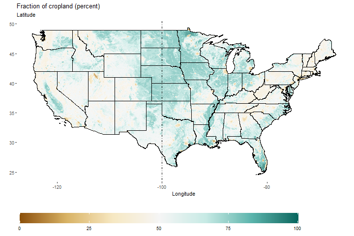

# Cropland patterns for the United States, 2001-2019
## Transforming NLCD rasters (at 30x30 meters resolution) into PRISM resolution (at 4x4km resolution)

**Description**: This repository transforms NLCD rasters (at 30x30 meters resolution) into PRISM resolution (at 4x4km resolution), and shows patterns throughout the years.

The `code/nlcd_prism_raster_creations.R` makes the transformation. This is done because smaller rasters are easier to handle, and they can be downloaded it. The transformed rasters are storage in `output\nlcd_prism_rasters`.

On a technical note, while the script has been optimized for space (I know how it can be done better, but it will be done in the future), I recommend to have about 100 GB of free disk space. Also, I work with 64GB of ram and intel processors. The task takes about a day to run on my computer, but it may take longer for you.

Finally, the `code/cropland_maps.R` produces the maps shown below. and storaged in `output\figs\`. Notice that the maps are split with the usual 100th longitude, following works such as in Nava, Ridley and Dall'Erba (2023). 

**Temporal average**

All mistakes are my own.

**References:**
Nava Noé J, Ridley Bill, Dall'Erba Sandy. *A model of the U.S. food system: What are the determinants of the state vulnerabilities to production shocks and supply chain disruptions?*, **Agricultural Economics**, 54(1): 95-109.

